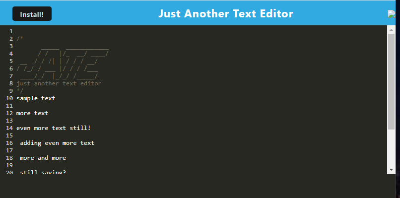
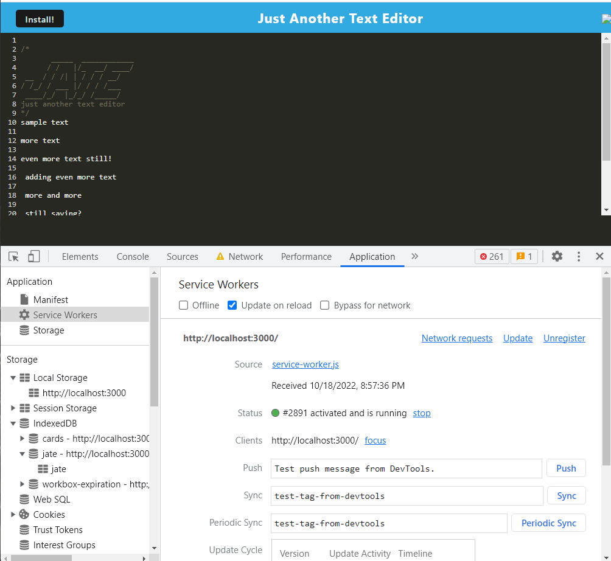
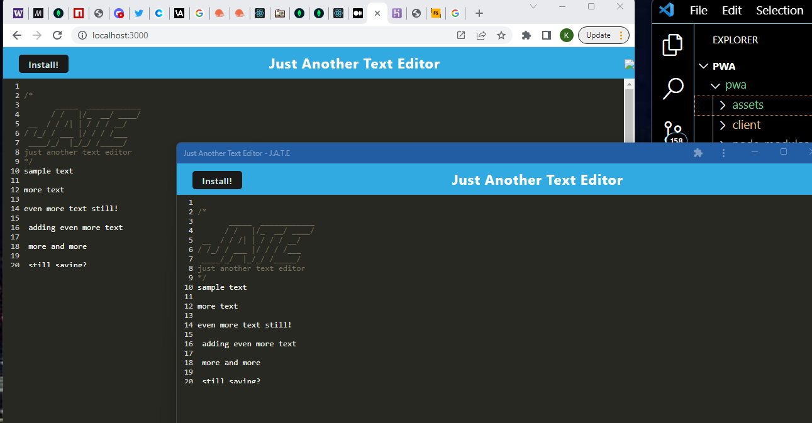

# Progressive Web Application - Text Editor (J.A.T.E)  
Module 19 Challenge - PWA  

## Developer Info  
- Developed by Karl Linfeldt 
- [Live Page Deployment](https://frozen-hamlet-33467.herokuapp.com/)
- [Github Repo](https://github.com/KarlOL82/pwa)  
- [email](klinfeldt@gmail.com)  

## User Story  
AS A developer
I WANT to create notes or code snippets with or without an internet connection
SO THAT I can reliably retrieve them for later use  

## Overview  
The J.A.T.E. text editor is a Progressive Web Application designed to allow users to write notes and code snippets and have their text stored by the application. The app is able to be installed on the user's desktop by simply clicking a button in the browser and the saved text is stored by the service worker.  

## Installing and Running the App  
To use the app, simply navigate to the live webpage using the above link and the text editor is ready to use in the browser upon page load. To install it locally for expedited and offline use, simply click the "Install" button in the browser and look for the icon on your desktop.  

## License  
## License
    
  https://opensource.org/licenses/MIT  

  This application is using the MIT license.  

## Screenshots  

  

  

  

